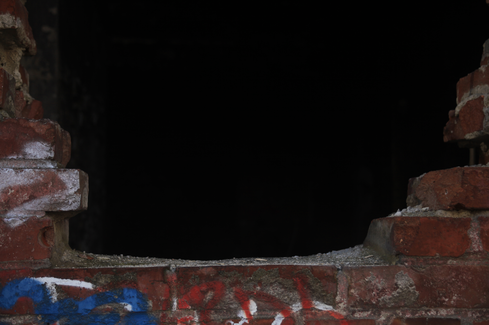

# Moara lui Assan

Acum cativa ani mergand pe jos intre statia de metrou de la Obor si cea de la Stefan cel Mare am vazut ascuzandu-se printre blocuri comuniste o cladire imensa care semana extrem de mult cu un castel fortareata. Curios am cautat pe internet sa vad despre ce era vorba si am aflat ca acea cladire reprezenta prima moara cu abur din Romania. A fost construita in 1853 de catre *Gheorghe Assan* si *Ioan Martinovici*. Este considerata monument istoric si desi a rezistat cu brio demolarilor ceausiste, in ultimii ani a ajuns o ruina datorita nepasarii autoritatilor. Singurele momente in care mai este bagata in seama este atunci cand este cuprinsa de cate un incendiu aparut asa din senin sau cand i se prabuseste vreun acoperis.

## Intrarea

Nu va asteptati la `Alice in tara minunilor` o data ce ati patruns *`down the rabbit hole`*, insa realitatea poate surpinde mai mult decat credeti. A se vedea la sfarsit.

## Corpurile principale

Ajunsi pe taramul fermecat putem sa admiram maretia corpurilor principale ale cladirii si nu putem sa nu ne gandim in cate moduri ar fi putut fi reamenajate daca cineva s-ar fi ocupat de ele (muzeu, sala de repetitii, casa de inregistrari audio)

## Vaporul lui Assan

Mergand putin mai jos, putem vedea `vaporul` care seamana cu o cetate din epopeea lui Ghilgames.

## Labirinturi

In caz ca vrei sa vizitezi fiecare cotlon ar trebui sa ai grija. Este un haos total in care te poti rataci, in caz ca nu esti un erou grec si ai un ghem cu ata la tine.

## Trainspotting

Am gasit o lingura abandonata. Pentru cei care ati vazut filmul `Trainspotting` (daca nu l-ati vazut uitati-va, merita :D) cred ca banuiti la ce se foloseste. Vorbeam la inceput de `Alice in tara minunilor`. Ei bine, cam asta a ajuns si moara, locul unde se retrag diferite personaje fantastice pentru a petrece cateva ore in `tara minunilor` evident.

